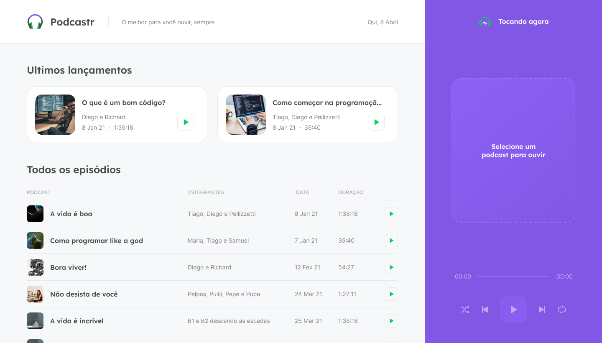
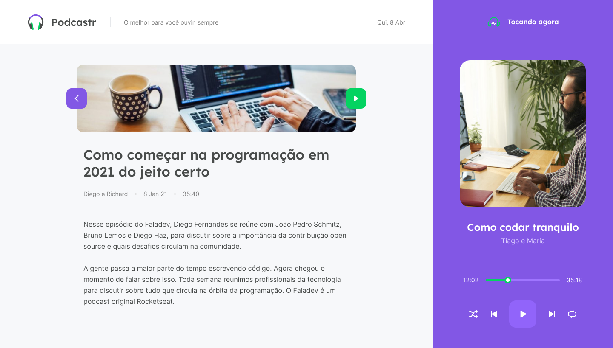

<h1 align="center">
    <br>
    
</h1>
<h4 align="center">
    Trilha ReactJS 
</h4>
<!-- <h4 align="center">Projeto web construído durante o Next Level Week #05-Discovery com a Rocketseat/DiegoFernandes.</h4> -->
<p align="center">
    
    <a aria-label="Completado" href="https://nextlevelweek.com/episodios/react/5/edicao/5">
        </img>
    </a>
    
    <a href="https://github.com/NyctibiusVII/Podcastr/blob/main/LICENSE">
        
    </a>
    <a href="https://picpay.me/Matheus_nyctibius_vii">
        
    </a>
</p>
<p align="center">
    <a href="#podcastr-">Projeto</a>&nbsp;&nbsp;&nbsp;|&nbsp;&nbsp;&nbsp;
    <a href="#tecnologias-">Tecnologias</a>&nbsp;&nbsp;&nbsp;|&nbsp;&nbsp;&nbsp;
    <a href="#layout-">Layout</a>&nbsp;&nbsp;&nbsp;|&nbsp;&nbsp;&nbsp;
    <a href="#licença-%EF%B8%8F">Licença</a>
</p>

# Podcastr 
Projeto desenvolvido para gerenciar seus podcasts. Projeto realizado na Next Level Week #5 @Rocketseat.

###### O melhor para você ouvir, sempre. 🎧🎶

<br>

#### Funcionalidades 
* Escutar podcast.
* Visualizar sobre o que se trata o podcast.
* Gerenciar podcasts.
* ❌ Modal Cookies consent
* ❌ Site responsivo.

## Tecnologias 🚀
Esse projeto foi desenvolvido com as seguintes tecnologias:
- [Html | 5](https://pt.wikipedia.org/wiki/HTML)
- [Css | 3](https://pt.wikipedia.org/wiki/Cascading_Style_Sheets)
- [Typescript | ^4.2.4](https://www.typescriptlang.org/)
- [ReactJS | ^17.0.2](https://pt-br.reactjs.org/)
- [NextJS | ^10.1.3](https://nextjs.org/)
- [NodeJS | ^14.16.1](https://nodejs.org/en/)

## Layout 🚧
## Desktop Screenshot
<div style="display: flex; flex-direction: 'column'; align-items: 'center';">
<!-- Responsive, 1440 x 900, 50% (Laptop L - 1440px)-->
    
    
    
</div>
<a href="./.github/README-IMGS.md">Ver mais</a>

## Mobile Screenshot
<div style="display: flex; flex-direction: 'row';">
<!-- Responsive, 425 x 900, 60% (Mobile L - 425px)-->
    Em breve...
    <!---->
    <!---->
    <!---->
</div>


## Rodando o projeto 🚴🏻‍♂️
#### "Só vou dar uma olhadinha...":
  <a href="https://nlw-5-react-podcastr.vercel.app/">🎧 Site hospedado na Vercel 🎶</a>

#### Na sua maquina:
<details>
    <summary>Dependências</summary>

```json
    "dependencies": {
        "next": "10.1.3",
        "react": "17.0.2",
        "react-dom": "17.0.2"
    },
    "devDependencies": {
        "@types/node": "^14.14.41",
        "@types/react": "^17.0.3",
        "@types/react-dom": "^17.0.3",
        "typescript": "^4.2.4"
    }
    //Ex: $ npm install @types/_____ -D
```
</details>

```bash
# Clone o repositório
$ git clone gh repo clone paulofreitas-py/NLW-5-React

# Acesse a pasta do projeto no prompt de comando
$ cd podcastr

# Instale as dependências
$ npm install

# Execute o script "dev"
$ npm run dev

# O projeto inciará na porta: 3000 - acesse http://localhost:3000
```

## Contribuição 💭
Para construir essa aplicação tive a ajuda do professor **Diego Fernandes** da Rocketseat que disponibilizou video aulas do projeto **Podcastr** e tive uma ajuda desta grande comunidade que a Rocketseat construiu no *Discord*.
Feito com ♥ by Rocketseat :wave: [Participe da nossa comunidade!](https://discord.gg/YxU7fJT)

### Hashtags \#
| Dias  | Hashtags            |
|-------|---------------------|
| Dia 1 | #MissaoEspacial     |
| Dia 2 | #EmBuscaDoPróximoNível |
| Dia 3 | # |
| Dia 4 | # |
| Dia 5 | # |

## Licença ⚖️
Este projeto está sob a licença do MIT. Veja o arquivo [LICENSE](https://github.com/paulofreitas-py/NLW-5-React/blob/main/LICENSE) para mais detalhes.

## Contato ✉️
